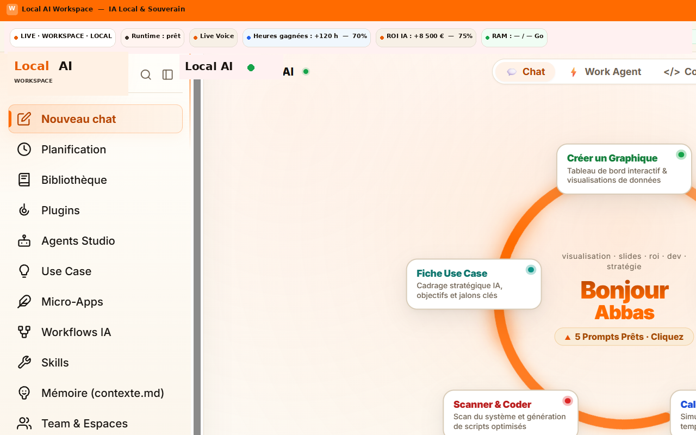

# LeBon AI

**Internal agentic workspace** — AI that ships for real operating work, under a governed transformation mandate.

<p align="center">
  
</p>

---

## What it is

Delivery surface for day-to-day AI work:

- Local / controlled agentic workspace
- Copilots, workflows, agents, use-case framing
- Evidence that transformation runs — not only slides

Sits **under** Boussole (portfolio / governance), not instead of it.

---

## Architecture

```text
  Boussole (selection · adoption · proof)
              │
              ▼
  ┌───────────────────────────────┐
  │           LeBon AI            │
  │  chat · agents · workflows    │
  │  planification · bibliothèque │
  └───────────────┬───────────────┘
                  │
        Operators / Eng / Domain
```

---

## Screens

| View | File |
|------|------|
| Hero — home / workspace | `docs/hero.png` |
| Nouveau chat | `docs/chat.png` |
| Agents Studio | `docs/agents-studio.png` |
| Workflows IA | `docs/workflows.png` |
| Use Case | `docs/use-case.png` |
| Planification | `docs/planification.png` |
| Bibliothèque | `docs/bibliotheque.png` |

<p align="center">
  
</p>

<p align="center">
  
</p>

---

## Status

Showcase narrative + selected UI.  
Review for proprietary metrics / branding before public push (`HOLD.md`).

---

## Author

**Abbas Mistrah** — Directeur / VP AI & Transformation  

[mistrah.com](https://mistrah.com) · [GitHub profile](https://github.com/abbas-mistrah)
