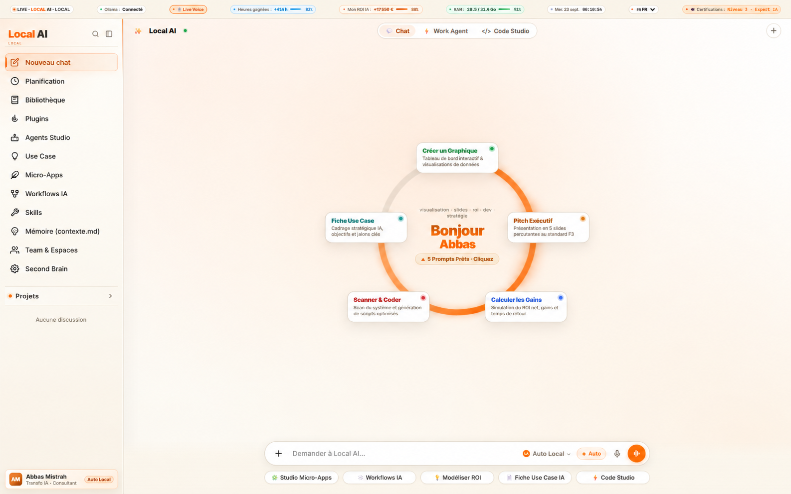
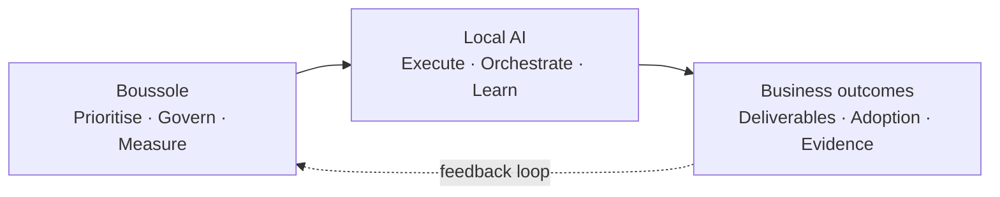
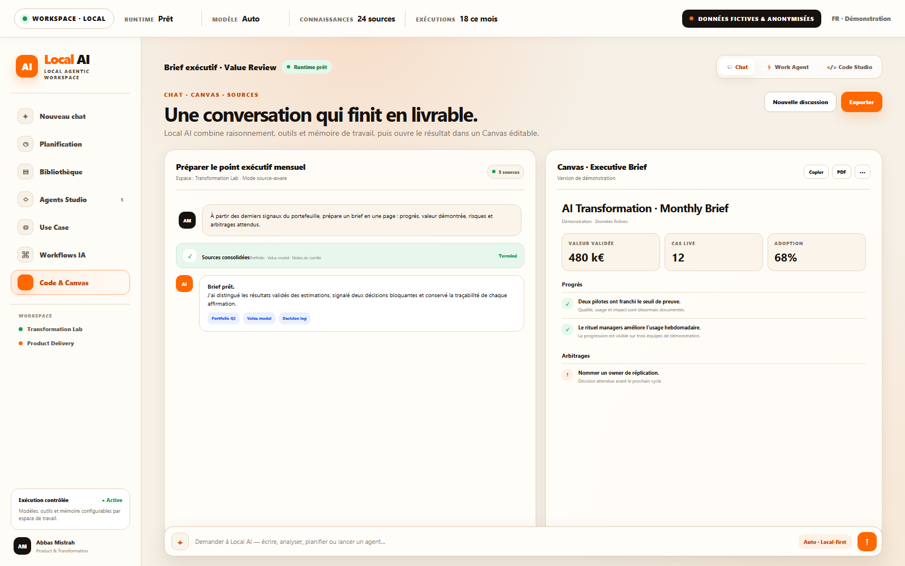
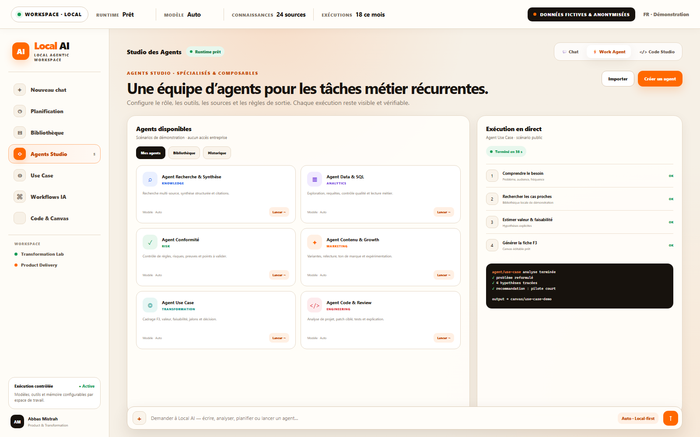
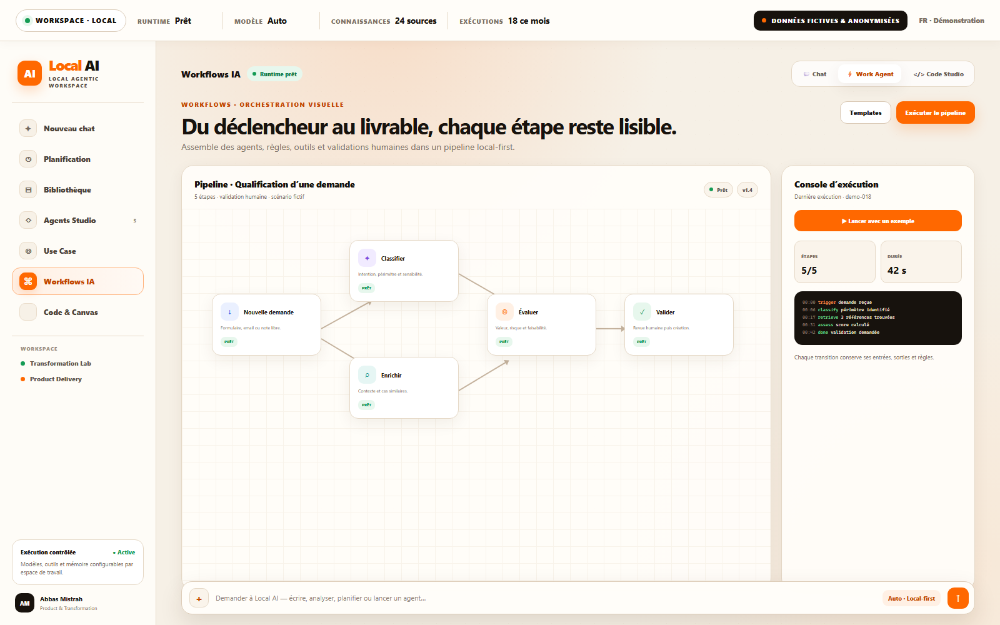
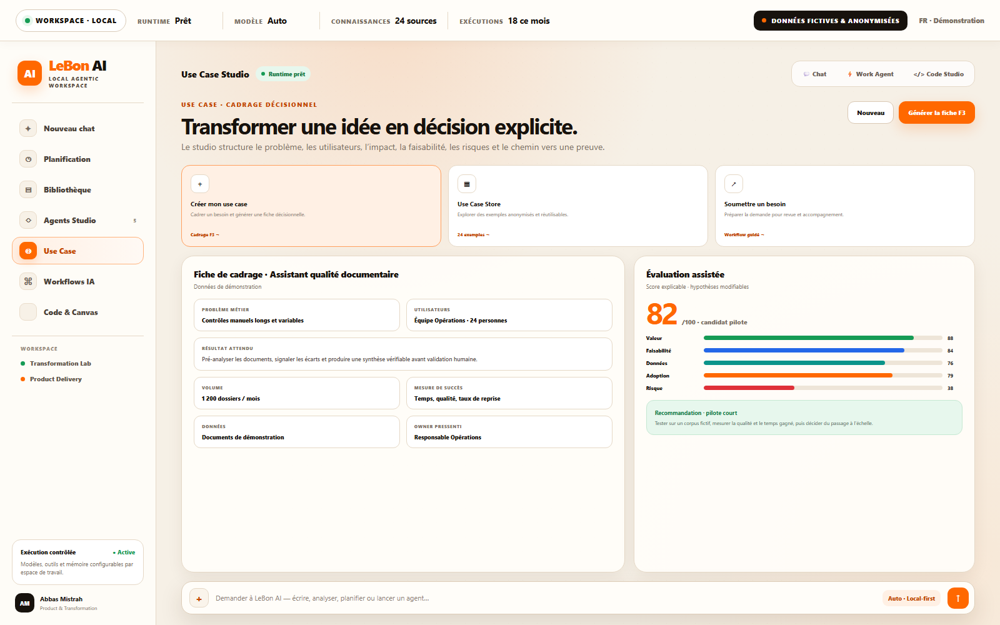
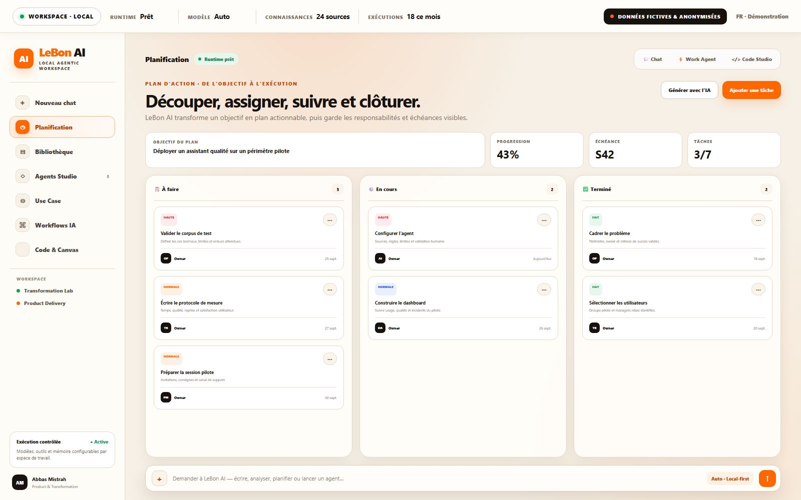
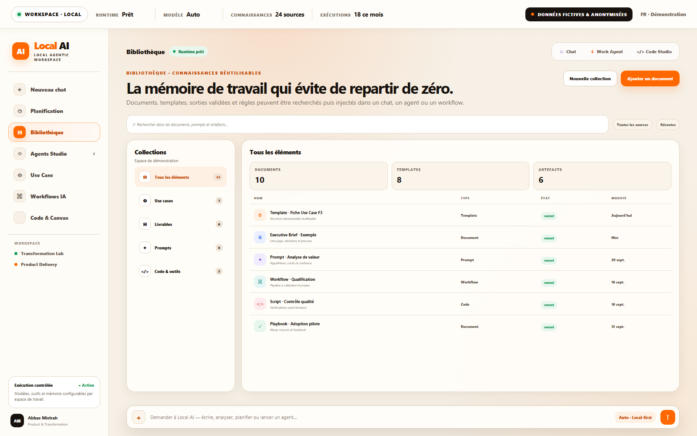
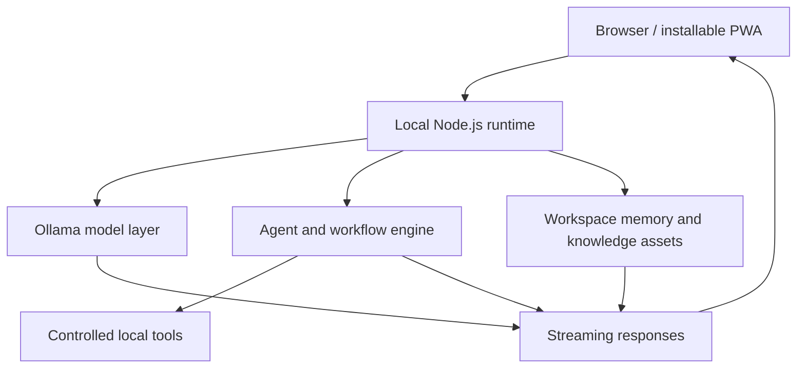

# Local AI

### Local-first Agentic Workspace

**From intent to governed execution.**

Local AI turns complex knowledge work into traceable outcomes. Conversations become editable deliverables, business needs become scored use cases, specialist agents become visible executions, and reusable knowledge stays available for the next decision.

<p align="center">
  
</p>

<p align="center">
  <strong>CHAT</strong> · <strong>AGENTS</strong> · <strong>WORKFLOWS</strong> · <strong>USE CASES</strong> · <strong>PLANNING</strong> · <strong>KNOWLEDGE</strong>
</p>

---

## The execution layer for AI transformation

AI transformation often breaks between the strategy deck and everyday work. Local AI closes that gap with one workspace where teams can frame a need, mobilise the right agent, orchestrate a workflow, validate the output, plan the rollout and preserve what was learned.

It complements [Boussole](https://github.com/abbas-mistrah/boussole):



> **Boussole decides where transformation should go. Local AI helps teams make it happen.**

---

## One workspace, six connected capabilities

| Capability | What happens inside Local AI | Operational result |
|---|---|---|
| **Conversation → deliverable** | Reason over sources, use tools and continue in an editable canvas | Work ends in a usable brief, not a disposable answer |
| **Agents Studio** | Configure specialist roles, models, sources, tools and output rules | Recurrent expert work becomes repeatable and inspectable |
| **Visual workflows** | Connect triggers, agents, checks and human validation | Every transition and decision remains visible |
| **Use Case Studio** | Structure the problem, users, value, feasibility, risk and evidence path | Ideas become explicit investment decisions |
| **Planning** | Turn an objective into owned tasks, milestones and measurable completion | Transformation moves from intention to execution |
| **Knowledge library** | Reuse documents, prompts, templates, workflows and validated outputs | Teams compound knowledge instead of restarting from zero |

---

## Product tour

### 1. Start from the outcome

Choose the job to be done—analyse, create, code, frame or measure—then let Local AI assemble the right working surface.

<p align="center">
  
</p>

### 2. Turn a conversation into an executive deliverable

Chat, source grounding and an editable canvas live side by side, so the path from request to decision-ready output stays short and legible.

<p align="center">
  
</p>

### 3. Mobilise specialist agents

Create focused agents for research, analytics, compliance, content, use-case framing or engineering. The execution trace exposes the steps, controls and resulting artifact.

<p align="center">
  
</p>

### 4. Orchestrate work visually

Compose a pipeline from trigger to classification, enrichment, evaluation and human validation. Runtime signals make progress and exceptions immediately understandable.

<p align="center">
  
</p>

### 5. Turn an idea into an explicit decision

Use Case Studio frames the business problem, target users, expected result, data, owner and success measures, then exposes an explainable readiness score.

<p align="center">
  
</p>

### 6. Convert the decision into an owned plan

Break an objective into prioritised work, assign responsibility and keep deadlines and progress visible from pilot to completion.

<p align="center">
  
</p>

### 7. Build organisational memory

Search and reuse validated documents, prompts, templates, workflows and code assets across future conversations and executions.

<p align="center">
  
</p>

---

## Designed for controlled execution

- **Local-first by design** — inference can run through Ollama on the workstation.
- **Human validation at key moments** — workflows can keep judgement and approval explicit.
- **Inspectable execution** — steps, sources, rules and outputs remain understandable.
- **Composable building blocks** — chats, agents, workflows, plans and knowledge reinforce one another.
- **Model-flexible workspace** — the model is selected according to the task instead of defining the product.
- **Reusable evidence** — validated outputs can become inputs for the next transformation cycle.

---

## Architecture



The current application is a dependency-light JavaScript workspace served locally by Node.js, with Ollama providing the local model runtime.

---

## Run locally

### Requirements

- Node.js LTS
- [Ollama](https://ollama.com/)

### Windows

Launch `LeBon-AI.bat`. The script starts the local AI runtime and opens the workspace at `http://localhost:4321`.

### Manual start

```bash
ollama serve
node server.js
```

Then open `http://localhost:4321`.

### Verification

With the server running:

```bash
node --test tests/test-server.js
```

---

## Product principles

1. **A response is not an outcome.** The default destination is a decision, artifact or completed action.
2. **Autonomy must remain legible.** Every agentic step should be understandable and reviewable.
3. **Transformation needs memory.** Validated work should make the next cycle faster and stronger.
4. **Proof belongs in the workflow.** Value, adoption and evidence should be captured while work happens.

---

## Showcase note

The screenshots in this repository are product demonstrations created with fictional, anonymised data. They illustrate the Local AI experience without exposing production or company information.

---

## Product leadership

**Abbas Mistrah** — AI & Transformation Product Leader<br />
[mistrah.com](https://mistrah.com) · [GitHub](https://github.com/abbas-mistrah)
